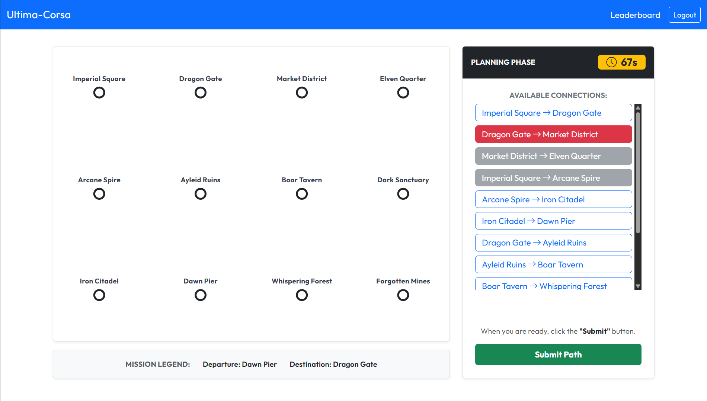
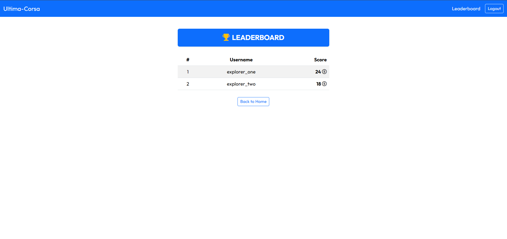

# Exam 1: "Ultima Corsa"
## Student: s359863 Robustelli Luca 

## React Client Application Routes

- Route `/`: Homepage and Autentication. If user is logged out it show login form. If logged in it show game rules and some buttons to navigate.
- Route `/game`: Main game page (need login). It manage the game states (setup, planning, execution, result) and show the interactive subway map.
- Route `/leaderboard`: Show the global leaderboard (need login), sort players by highest score in decending order.

## API Server

- `POST /api/sessions`: Authenticate user with `{ username, password }`.
  * **Success** (`201`): Returns `{ username }`.
  * **Errors**: `(400)` `{ error: "Username is required" }` (or Password); `(401)`: `{ error: "Not authenticated." }`.

- `GET /api/sessions/current`: Get the active session.
  * **Success** (`200`): Returns `{ username }`.
  * **Errors**: `(401)`: `{ error: "Not authenticated." }`.

- `DELETE /api/sessions/current`: Destroy the active session.
  * **Success** (`204`): Empty body. No errors expected.

- `GET /api/network`: Get the map topology (need login).
  * **Success** (`200`): Returns `{ stations, lines, connections }`.
  * **Errors**: `(401)`: `{ error: "Not authenticated." }`; `(500)`: `{ error: "Internal server error." }`.

- `GET /api/game/planning`: Start a new game (need login).
  * **Success** (`200`): Returns `{ startStation, endStation }`.
  * **Errors**: `(401)`: `{ error: "Not authenticated." }`; `(500)`: `{ error: "Internal server error." }`.

- `POST /api/game/execution`: Submit the user route `{ path: [id1, id2, ...] }` (need login).
  * **Success** (`201`): Returns `{ journeyEvents: [...] }`.
  * **Errors**: `(400)`: `{ error: "msg" }` where `msg` can be "The path must be an array", "Maximum time of 90 seconds exceeded...", "Invalid path...", etc; `(401)`: `{ error: "Not authenticated." }`; `(500)`: `{ error: "Internal server error." }`.

- `GET /api/leaderboard`: Get global rankings (need login).
  * **Success** (`200`): Returns array of `{ username, bestScore }`.
  * **Errors**: `(401)`: `{ error: "Not authenticated." }`; `(500)`: `{ error: "Internal server error." }`.

## Database Tables

- Table `users`: Store user credential, including `username`, `password_hash`, and the cryptographic `salt`.
- Table `lines`: Store subway lines name and id.
- Table `stations`: Store subway stations name and id.
- Table `connections`: Store the phisical tracks connecting `station_a_id` to `station_b_id` via `line_id`.
- Table `events`: Contain random events, store `description` and coin `effect` (+/-).
- Table `games`: Store the games results, link a `user_id` to the final `score`.

## Main React Components

- `HomePage`: Welcome screen with rules and handle the login form (or show navigation if logged in).
- `GamePage`: The main controller of game. Manage the 90s timer and 4 game states (setup, planning, execution, result).
- `NetworkMap`: A SVG component that dynamicly draw the subway network and highlight user selected paths.
- `SidePanels`: A group of panels (`SetupPanel`, `PlanningPanel`, `ExecutionPanel`, `ResultPanel`) that guide user step by step.
- `Leaderboard`: Fetch and render a table of best scores achieved by players.

## Screenshots

## Users Credentials

- `explorer_one`, `password1`
- `explorer_two`, `password2`
- `explorer_three`, `password3`

## Use of AI Tools

- **Gemini and Claude**: I used them to speed up UI development, they suggest Bootstrap classes and the use of HTML SVG tags (`<line>`, `<circle>`) to draw the map in React. The CSS and SVG was manualy tested and adapted for responsivness.
- **ChatGPT**: I used ChatGPT to brainstorm a list of creative medieval/fantasy names for subway stations and lines to enhance game theme. Output was used to populate database.
- **Prettier**: Used as code formater to ensure clean and profesional style.
